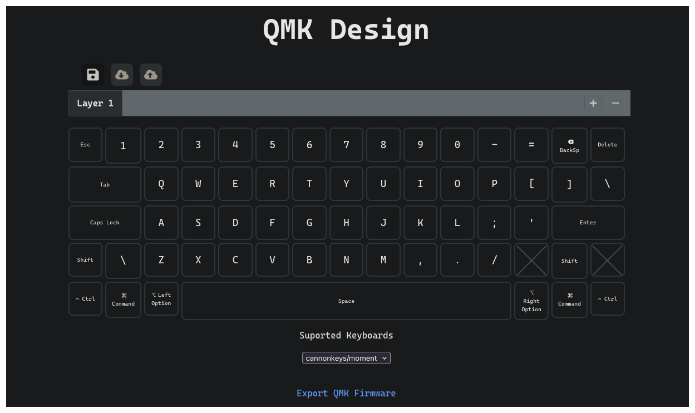

# QMK Design Frontend

Frontend for my QMK Design project which allows the user to generate QMK firmware using a GUI.



Built in React with Typescript.


### Running Locally

The project is containerized, please use the Dockerfile to build and run the project. 

```bash
docker build -t qmkdesign-frontend . && docker run -p 5173:5173 qmkdesign-frontend
```

NOTE: If running locally make sure to set the environment variables:
* VITE_GOOGLE_AUTH_CLIENT_ID - Google Auth Client ID for using Google's OAuth2 Provider
* VITE_BACKEND_BASE_URL - Base URL For the Backend API


The project is also hosted on AWS currently [here](http://d2m1tu7j8e1ut4.cloudfront.net/).

### Resources Used

The main resources I used to make this frontend was the documentation for each respective library/tool. \
I have listed some below that were noteworthy:

* [vite](https://vite.dev/guide/)
* [vitest](https://vitest.dev/guide/)
* [React](https://react.dev/reference/react)
* [QMK](https://docs.qmk.fm/newbs_building_firmware)
* [Google OAuth](https://www.npmjs.com/package/@react-oauth/google)
    * [Google OAuth User Info](https://developers.google.com/identity/protocols/oauth2)

Here are some helpful articles that helped me along the way as well.
* [Hosting site via S3](https://collin-smith.medium.com/creating-a-simple-vite-react-front-end-application-hosted-in-s3-and-cloudfront-with-terraform-0526479502e3)
* [S3 Upload GH Workflow](https://www.timveletta.com/blog/pushing-content-to-s3-from-github-actions/)
* [Invalidate files on cloudfront](https://docs.aws.amazon.com/AmazonCloudFront/latest/DeveloperGuide/Invalidation.html)
    


