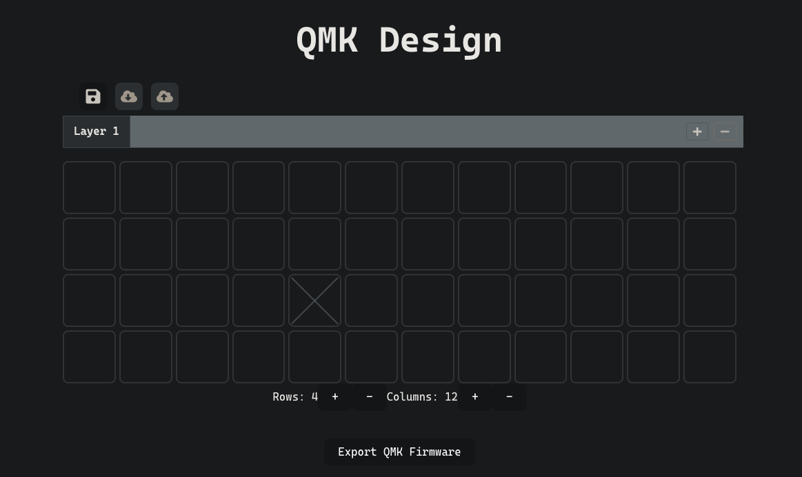

# QMK Design Frontend

Frontend for my QMK Design project which allows the user to generate QMK firmware using a GUI.

Built in React with Typescript via Vite.

### Resources Used

The main resources I used to make this frontend was the documentation for each respective library/tool. 

I have listed some below that were noteworthy:

* [vite](https://vite.dev/guide/)
* [vitest](https://vitest.dev/guide/)
* [React](https://react.dev/reference/react)
* [QMK](https://docs.qmk.fm/newbs_building_firmware)
    

